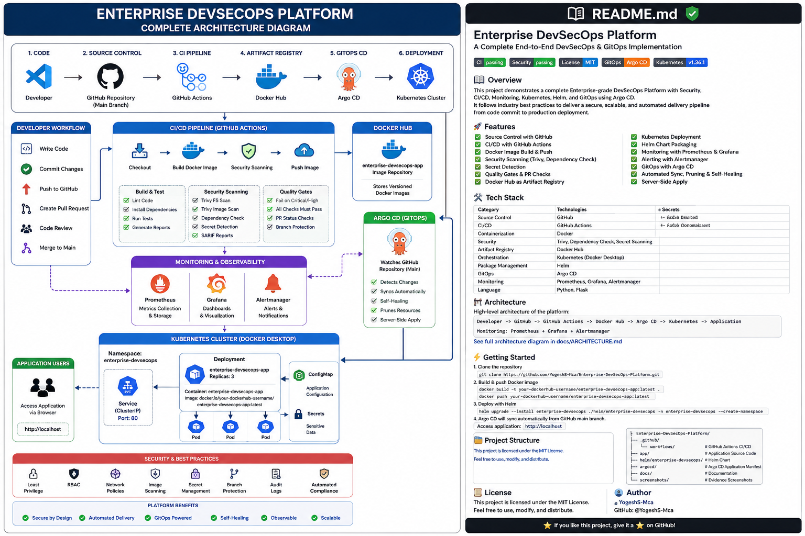

# 🚀 Enterprise DevSecOps Platform

> **A production-inspired DevSecOps and GitOps engineering platform built incrementally to demonstrate how application development, CI, security, observability, Kubernetes, Helm, and continuous delivery work together.**

This project started with a small Python application, but the objective was never simply to containerize an application or collect multiple DevOps tools inside one repository.

I built the platform phase by phase to understand the complete engineering lifecycle:

```text
Code
  ↓
Test
  ↓
Containerize
  ↓
Observe
  ↓
Secure
  ↓
Deploy
  ↓
Package
  ↓
Continuously Reconcile
```

The completed platform integrates:

- Python + Flask application engineering
- Docker containerization and runtime hardening
- Docker Compose
- Prometheus monitoring
- Grafana visualization
- Pytest automated testing
- GitHub Actions CI
- Trivy DevSecOps security scanning
- Kubernetes orchestration
- Helm packaging and release management
- Argo CD GitOps continuous delivery
- Automated synchronization
- Kubernetes drift detection
- Argo CD self-healing

The repository also documents failures, troubleshooting, architecture decisions, validation steps, screenshots, and lessons learned during implementation.

---

# 🏗️ Final Platform Architecture



The completed delivery architecture follows this model:

```text
                           Developer
                               │
                               │ git push / pull request
                               ▼
                       GitHub Repository
                               │
                               ▼
                        GitHub Actions
                               │
                 ┌─────────────┴─────────────┐
                 │                           │
                 ▼                           ▼
          Application CI                 Security CI
                 │                           │
           ┌─────┴─────┐              ┌──────┴──────┐
           │           │              │             │
           ▼           ▼              ▼             ▼
        Pytest     Docker Build   Repository Scan  Image Scan
           │           │              │             │
           └─────┬─────┘              └──────┬──────┘
                 │                           │
                 └─────────────┬─────────────┘
                               │
                               ▼
                       Validated Change
                               │
                               ▼
                       Pull Request / Merge
                               │
                               ▼
                              main
                               │
                       Desired State in Git
                               │
                               ▼
                            Argo CD
                      ┌────────┴────────┐
                      │                 │
                   Auto Sync         Self-Heal
                      │                 │
                      └────────┬────────┘
                               │
                               ▼
                              Helm
                               │
                               ▼
                          Kubernetes
                               │
                      ┌────────┴────────┐
                      │                 │
                      ▼                 ▼
               Application Pods     Service
                      │
                      │ /metrics
                      ▼
                  Prometheus
                      │
                      ▼
                    Grafana
```

The architecture evolved throughout the project rather than being designed only after implementation.

The platform progressed through:

```text
Application
    ↓
Docker
    ↓
Observability
    ↓
CI
    ↓
Security
    ↓
Kubernetes
    ↓
Helm
    ↓
Argo CD
    ↓
GitOps
```

---

# 🟢 Project Status

| Phase | Engineering Area | Status |
|---|---|---|
| Phase 1 | Repository Foundation | ✅ Complete |
| Phase 2 | Flask Application & Operational Endpoints | ✅ Complete |
| Phase 3 | Docker Containerization & Runtime Hardening | ✅ Complete |
| Phase 4 | Prometheus & Grafana Observability | ✅ Complete |
| Phase 5 | Automated Testing & GitHub Actions CI | ✅ Complete |
| Phase 6 | DevSecOps Security Scanning | ✅ Complete |
| Phase 7 | Kubernetes Deployment | ✅ Complete |
| Phase 8 | Helm Packaging & Release Management | ✅ Complete |
| Phase 9 | Argo CD GitOps Continuous Delivery | ✅ Complete |
| Final | Architecture & Portfolio Documentation | ✅ Complete |

---

# ⭐ Engineering Highlights

## 🔄 Continuous Integration

Application changes are automatically validated using:

- Pytest
- API endpoint testing
- Test coverage
- Docker image build validation
- Push-triggered workflows
- Pull-request-triggered workflows

The CI workflow follows:

```text
Code Change
    ↓
Git Push / Pull Request
    ↓
GitHub Actions
    ↓
Install Dependencies
    ↓
Run Tests
    ↓
Docker Build Validation
    ↓
Validation Result
```

---

## 🔐 Shift-Left Security

Security validation is integrated into the development workflow instead of being treated only as a post-deployment activity.

Implemented controls include:

- Repository vulnerability scanning
- Secret scanning
- Misconfiguration scanning
- Container image scanning
- HIGH and CRITICAL vulnerability analysis
- Runtime dependency verification
- GitHub Actions security automation

Security flow:

```text
Source Code
    ↓
GitHub Actions
    ↓
Trivy
    │
    ├── Repository Scan
    │
    ├── Vulnerability Scan
    │
    ├── Secret Scan
    │
    ├── Misconfiguration Scan
    │
    └── Container Image Scan
```

---

## 📊 Observability

Prometheus and Grafana provide visibility into:

- Application availability
- HTTP request totals
- Requests by endpoint
- HTTP request rate
- Application memory usage
- Application CPU usage
- Open file descriptors

Runtime observability:

```text
Application
     │
     │ /metrics
     ▼
Prometheus
     │
     │ PromQL
     ▼
Grafana
```

---

## 🐳 Container Security

The application runtime includes:

- Slim Python base image
- Dedicated non-root user
- Waitress production WSGI server
- Docker health checks
- Optimized dependency layers
- Dedicated Docker networking
- Persistent monitoring volumes

---

## ☸️ Kubernetes Orchestration

The application was moved from a standalone Docker environment into Kubernetes.

Implemented capabilities include:

- Namespace isolation
- Deployment management
- Multiple replicas
- ClusterIP service
- Liveness probes
- Readiness probes
- Resource requests
- Resource limits
- Security context
- Non-root execution
- Linux capability dropping
- Kubernetes self-healing behavior

---

## 📦 Helm Release Management

The Kubernetes deployment was evolved into a reusable Helm release.

The Helm phase included:

- Chart creation
- Parameterized values
- Helm templates
- Chart linting
- Template rendering
- Server-side dry-run validation
- Existing Kubernetes resource adoption
- Release management
- Upgrade validation
- Release history
- Rollback validation
- Chart packaging

---

## 🔄 Argo CD GitOps

The final delivery model uses Git as the source of truth for the desired Kubernetes state.

Argo CD continuously compares:

```text
Desired State in Git
        ↕
Actual Kubernetes State
```

The implementation includes:

- Automated synchronization
- Resource pruning
- Self-healing
- Namespace creation
- Server-Side Apply
- Helm integration
- Git-driven deployment changes
- Drift detection
- Automatic reconciliation

---

# 🧰 Technology Stack

| Engineering Area | Technologies |
|---|---|
| Application | Python, Flask |
| Production WSGI | Waitress |
| Testing | Pytest, pytest-cov |
| Containerization | Docker |
| Multi-container Runtime | Docker Compose |
| CI | GitHub Actions |
| Security | Trivy |
| Orchestration | Kubernetes |
| Package Management | Helm |
| GitOps / Continuous Delivery | Argo CD |
| Metrics | Prometheus |
| Visualization | Grafana |
| Source Control | Git, GitHub |
| Local Development | Visual Studio Code, PowerShell |

---

# 📁 Repository Structure

```text
enterprise-devsecops-platform/
│
├── .github/
│   └── workflows/
│       ├── ci.yml
│       └── security.yml
│
├── app/
│   └── app.py
│
├── argocd/
│   └── application.yaml
│
├── diagrams/
│   └── enterprise-devsecops-platform-final-architecture.png
│
├── docs/
│   ├── 04-monitoring-stack.md
│   ├── 06-security-scanning.md
│   ├── 07-kubernetes-deployment.md
│   ├── 08-helm-packaging.md
│   └── 09-argocd-gitops.md
│
├── helm/
│   ├── enterprise-devsecops/
│   │   ├── templates/
│   │   ├── Chart.yaml
│   │   └── values.yaml
│   │
│   └── packages/
│
├── kubernetes/
│
├── monitoring/
│   ├── grafana/
│   │   └── dashboards/
│   └── prometheus/
│       └── prometheus.yml
│
├── screenshots/
│
├── security/
│   └── reports/
│
├── tests/
│   └── test_app.py
│
├── .dockerignore
├── .gitattributes
├── .gitignore
├── compose.yaml
├── Dockerfile
├── requirements.txt
├── requirements-dev.txt
└── README.md
```

---

# 🌐 Application Layer

The application exposes operational endpoints for application access, monitoring, and orchestration.

| Endpoint | Purpose |
|---|---|
| `/` | Application information |
| `/health` | Confirms application health |
| `/ready` | Confirms readiness to receive traffic |
| `/metrics` | Exposes Prometheus metrics |
| Invalid route | Returns structured JSON 404 response |

The application runs behind **Waitress** rather than the Flask development server.

---

# 🐳 Phase 3 — Containerization & Runtime Hardening

The Flask application is packaged into a Docker image.

Implemented practices include:

- Python slim base image
- Non-root application user
- Waitress production server
- Docker health check
- `.dockerignore`
- OCI image metadata
- Optimized dependency installation
- Runtime verification

Build:

```powershell
docker build -t enterprise-devsecops-platform:1.0.1 .
```

Run:

```powershell
docker run -d `
  --name enterprise-devsecops `
  --restart unless-stopped `
  -p 5001:5000 `
  enterprise-devsecops-platform:1.0.1
```

Verify:

```powershell
docker ps

docker logs enterprise-devsecops

docker exec enterprise-devsecops whoami
```

Expected runtime identity:

```text
appuser
```

Running the application as a non-root user reduces unnecessary container privileges.

---

# 🔗 Docker Compose Runtime

The runtime stack contains:

```text
Flask Application
       +
Prometheus
       +
Grafana
```

Start:

```powershell
docker compose up -d --build
```

Validate:

```powershell
docker compose ps
```

Stop:

```powershell
docker compose down
```

> Avoid `docker compose down -v` unless monitoring volumes are intentionally being deleted.

---

# 🌐 Docker Networking

Host access:

```text
Application → localhost:5001
Prometheus  → localhost:9090
Grafana     → localhost:3000
```

Internal Docker communication:

```text
Prometheus → app:5000/metrics
Grafana    → prometheus:9090
```

Docker service names are used as internal DNS names instead of depending on changing container IP addresses.

---

# 📊 Phase 4 — Monitoring & Observability

Phase 4 introduced application observability using:

```text
Application
     ↓
Prometheus
     ↓
Grafana
```

Prometheus scrapes:

```text
app:5000/metrics
```

Grafana uses Prometheus as its monitoring data source.

---

## 📈 Grafana Dashboard

Dashboard:

```text
Enterprise DevSecOps Monitoring Dashboard
```

Implemented panels:

| Panel | Visualization | Purpose |
|---|---|---|
| Application Availability | Stat | Application UP/DOWN |
| Total HTTP Requests | Stat | Cumulative traffic |
| Requests by Endpoint | Bar Gauge | Endpoint traffic |
| HTTP Request Rate | Time Series | Requests per second |
| Application Memory Usage | Time Series | Runtime memory |
| Application CPU Usage | Time Series | CPU utilization |
| Open File Descriptors | Stat | Runtime resource usage |

### Final Dashboard


---

# 🔎 Prometheus Queries

### Application Availability

```promql
up{job="enterprise-devsecops-app"}
```

### Total HTTP Requests

```promql
sum(application_http_requests_total)
```

### Requests by Endpoint

```promql
sum by (endpoint) (
  application_http_requests_total
)
```

### HTTP Request Rate

```promql
sum(
  rate(application_http_requests_total[5m])
)
```

### Application CPU Usage

```promql
sum(
  rate(process_cpu_seconds_total{job="enterprise-devsecops-app"}[5m])
)
```

---

# 🧪 Phase 5 — Automated Testing & CI

Phase 5 introduced automated quality validation.

The project uses:

- `pytest`
- `pytest-cov`
- GitHub Actions

Tests validate:

- Home endpoint
- Health endpoint
- Readiness endpoint
- Metrics endpoint
- Invalid-route behavior

Validated local test result:

```text
5 tests passed
```

CI flow:

```text
Push / Pull Request
        ↓
Checkout Repository
        ↓
Setup Python
        ↓
Install Dependencies
        ↓
Run Pytest
        ↓
Validate Docker Build
        ↓
CI Result
```

---

# 🔐 Phase 6 — DevSecOps Security Scanning

Phase 6 introduced automated security validation using:

```text
Trivy + GitHub Actions
```

The security workflow performs two primary categories of validation.

## 🔍 Repository Security Scan

The repository is analyzed for:

- Vulnerabilities
- Secrets
- Misconfigurations

```text
Source Repository
       │
       ├── Vulnerabilities
       │
       ├── Secrets
       │
       └── Misconfigurations
```

## 🛡️ Container Image Security Scan

The application image is scanned after building:

```text
Source Code
     ↓
Docker Build
     ↓
Container Image
     ↓
Trivy Image Scan
     ↓
HIGH / CRITICAL Analysis
```

This allows risks from both application dependencies and operating-system packages inside the image to be investigated.

---

# 🧠 Vulnerability Investigation

Scanner findings were treated as investigation triggers rather than automatically changing dependencies.

The process used was:

```text
Detect
   ↓
Verify
   ↓
Analyze Runtime Impact
   ↓
Check Available Remediation
   ↓
Remediate or Document
   ↓
Re-scan
```

Runtime dependencies were verified directly inside the built container where necessary.

This helped distinguish actual runtime dependencies from metadata or SBOM-related findings.

---

# ⚙️ Security Baseline Strategy

The security workflow initially prioritizes visibility and investigation.

The approach follows:

```text
Finding
   ↓
Report
   ↓
Investigate
   ↓
Document / Remediate
```

This introduces security progressively:

```text
Visibility → Understanding → Enforcement
```

---

# ☸️ Phase 7 — Kubernetes Deployment

After validating the application, container runtime, observability, CI, and security layers, I moved the application into Kubernetes.

The Kubernetes architecture follows:

```text
Namespace
    ↓
Deployment
    ↓
ReplicaSet
    ↓
Application Pods
    ↓
ClusterIP Service
```

The implementation includes:

- Dedicated namespace
- Deployment
- Multiple application replicas
- ClusterIP service
- Liveness probe
- Readiness probe
- CPU requests
- CPU limits
- Memory requests
- Memory limits
- Non-root security context
- Dropped Linux capabilities

The Kubernetes phase focused not only on creating YAML manifests but also on understanding:

- Pod lifecycle
- Deployment reconciliation
- Replica management
- Service discovery
- Health probes
- Resource management
- Security controls
- Runtime troubleshooting

Detailed engineering documentation:

```text
docs/07-kubernetes-deployment.md
```

---

# 📦 Phase 8 — Helm Packaging & Release Management

After the Kubernetes deployment was validated, the workload was converted into a reusable Helm chart.

Chart location:

```text
helm/enterprise-devsecops/
```

The phase followed:

```text
Kubernetes Manifests
        ↓
Helm Templates
        ↓
Parameterized Values
        ↓
Helm Release
        ↓
Upgrade
        ↓
Rollback
        ↓
Packaged Chart
```

Implemented and validated:

- `Chart.yaml`
- `values.yaml`
- Deployment template
- Service template
- Namespace template
- Helm helper templates
- Helm NOTES
- Chart linting
- Template rendering
- Server-side dry-run
- Release deployment
- Release upgrades
- Release history
- Rollback
- Chart packaging

---

## 🔄 Existing Resource Adoption Challenge

The Kubernetes resources already existed before Helm was introduced.

They had originally been created using:

```powershell
kubectl apply
```

The existing resources included:

```text
Namespace
Deployment
Service
```

Introducing Helm meant the chart attempted to manage resources with the same names.

This created a realistic migration challenge involving:

```text
Helm Release Ownership
          vs
Kubernetes Field Ownership
```

The migration process required:

```text
Existing kubectl-managed resources
        ↓
Render Helm chart
        ↓
Compare live and rendered resources
        ↓
Preserve stable selectors
        ↓
Validate with helm lint
        ↓
Validate with helm template
        ↓
Server-side dry-run
        ↓
Controlled resource adoption
```

The Deployment and Service selectors were intentionally preserved to avoid unnecessary workload identity changes during migration.

This phase demonstrated that adopting existing Kubernetes resources into Helm management requires more than simply creating a chart.

Detailed documentation:

```text
docs/08-helm-packaging.md
```

---

# 🔄 Phase 9 — Argo CD GitOps Continuous Delivery

The final platform phase introduced GitOps using **Argo CD**.

The Argo CD Application definition is stored at:

```text
argocd/application.yaml
```

Argo CD tracks:

```text
Repository:
Enterprise-DevSecOps-Platform

Branch:
main

Path:
helm/enterprise-devsecops
```

The application uses Helm as its source configuration.

The GitOps architecture became:

```text
Developer
    ↓
Git
    ↓
Pull Request
    ↓
main
    ↓
Argo CD
    ↓
Helm
    ↓
Kubernetes
```

---

# ⚙️ Argo CD Application Configuration

The GitOps application uses automated synchronization:

```yaml
syncPolicy:
  automated:
    prune: true
    selfHeal: true

  syncOptions:
    - CreateNamespace=true
    - ServerSideApply=true
```

This enables:

### Automated Sync

Changes merged into the tracked Git branch can automatically be reconciled into Kubernetes.

### Prune

Resources removed from the desired Git configuration can also be removed from the cluster.

### Self-Heal

Manual changes made directly to Kubernetes can be detected and reconciled back to the Git-defined state.

### CreateNamespace

The destination namespace can be created when required.

### Server-Side Apply

Kubernetes server-side field management is used during reconciliation.

---

# 🚀 Git-Driven Continuous Delivery Validation

GitOps was validated using a real desired-state change.

The Helm configuration changed from:

```yaml
replicaCount: 2
```

to:

```yaml
replicaCount: 3
```

The change followed:

```text
Feature Branch
      ↓
Change Helm Values
      ↓
Commit
      ↓
Push
      ↓
Pull Request
      ↓
GitHub Actions
      ↓
Merge to main
      ↓
Argo CD detects Git revision
      ↓
Automatic synchronization
      ↓
Kubernetes reaches 3 replicas
```

The deployment change did not require manually executing:

```text
kubectl apply
helm upgrade
argocd app sync
```

after the desired state was merged into Git.

Git became the deployment interface.

---

# ♻️ Argo CD Self-Healing Validation

I also tested what happens when someone manually changes the live Kubernetes environment.

The desired state stored in Git was:

```yaml
replicaCount: 3
```

Configuration drift was deliberately introduced:

```powershell
kubectl scale deployment/enterprise-devsecops-app `
  --replicas=5 `
  -n enterprise-devsecops
```

This created a difference between:

```text
Git Desired State    → 3 replicas
Kubernetes Live State → 5 replicas
```

Because Argo CD had self-healing enabled, the difference was detected and reconciled.

The Deployment automatically returned to:

```text
3 replicas
```

Final Argo CD state:

```text
Sync Status:   Synced
Health Status: Healthy
```

The test demonstrated an important GitOps concept:

```text
Git Desired State
        │
        ▼
     Argo CD
        │
        ├── Detect Drift
        │
        ├── Reconcile
        │
        └── Self-Heal
                │
                ▼
           Kubernetes
```

GitOps therefore provides more than automatic deployment.

It provides **continuous reconciliation**.

Detailed documentation:

```text
docs/09-argocd-gitops.md
```

---

# 🔁 Complete CI/CD + GitOps Workflow

The completed platform follows this engineering workflow:

```text
Developer
    ↓
Feature Branch
    ↓
Code / Configuration Change
    ↓
Git Push
    ↓
Pull Request
    ↓
GitHub Actions
    │
    ├── Pytest
    ├── Docker Build
    ├── Repository Security Scan
    └── Container Image Scan
    ↓
Validated Merge
    ↓
main
    ↓
Argo CD
    ↓
Helm
    ↓
Kubernetes
    ↓
Application
    ↓
Prometheus
    ↓
Grafana
```

Meanwhile, Argo CD continuously checks:

```text
Git
 ↕
Argo CD
 ↕
Kubernetes
```

If configuration drift occurs:

```text
Manual Cluster Change
        ↓
Drift Detected
        ↓
Argo CD Self-Heal
        ↓
Git Desired State Restored
```

---

# 🧯 Engineering Troubleshooting Cases

This repository intentionally documents failures as well as successful implementations.

## Case 1 — Host Port Conflict

A Windows process was already using the expected host port.

The final mapping separated host and container ports:

```text
Host:
localhost:5001

Container:
app:5000
```

This reinforced the difference between host port mapping and container networking.

---

## Case 2 — Docker Outbound Networking

During an image build, Windows could reach the external package repository while Docker bridge-network containers could not.

Testing was performed separately for:

- DNS resolution
- Host connectivity
- Container connectivity
- Docker bridge networking

The investigation isolated the failure domain rather than treating it as an application issue.

---

## Case 3 — Missing Runtime Dependency

A container initially failed because:

```text
waitress-serve
```

was unavailable at runtime.

Runtime and development dependencies were separated and the image was rebuilt and validated.

---

## Case 4 — Trivy GitHub Action Setup

Application CI succeeded while security jobs initially failed during Trivy setup.

The issue was isolated to security tooling rather than application code.

After correcting the integration, the pipeline was rerun.

Final validation:

```text
8 / 8 checks passed
```

---

## Case 5 — Kubernetes Runtime Validation

Kubernetes introduced additional troubleshooting around:

- Pod startup
- Replica reconciliation
- Liveness probes
- Readiness probes
- Resource configuration
- Security context
- Service connectivity

The running workload was validated rather than relying only on successful manifest application.

---

## Case 6 — Helm Existing Resource Adoption

Helm was introduced after Kubernetes resources already existed.

The migration required investigation into:

- Helm ownership
- Kubernetes field ownership
- Deployment selector compatibility
- Server-side validation
- Existing resource adoption

Instead of deleting the existing application and starting again, the migration was performed while preserving the healthy workload.

---

## Case 7 — Argo CD Local Port Conflict

While accessing the Argo CD dashboard, local port `8080` was already occupied.

The owning process was identified using PowerShell before creating another forwarding session.

This prevented unnecessary Kubernetes changes for what was actually a local port conflict.

---

## Case 8 — GitOps Configuration Drift

The Kubernetes Deployment was intentionally scaled away from the replica count defined in Git.

Argo CD detected the drift and automatically restored the Git-defined desired state.

This validated:

```text
Drift Detection
      +
Self-Healing
      +
Continuous Reconciliation
```

---

# 🔒 Security & Reliability Practices

The completed platform demonstrates:

- Non-root Docker container runtime
- Minimal Python base image
- Waitress production server
- Docker health checks
- Dedicated Docker networking
- Persistent monitoring storage
- Automated unit/API testing
- Docker build validation
- Repository vulnerability scanning
- Secret scanning
- Misconfiguration scanning
- Container vulnerability scanning
- Runtime dependency verification
- Kubernetes namespace isolation
- Multiple Kubernetes replicas
- Liveness probes
- Readiness probes
- CPU resource requests
- CPU resource limits
- Memory resource requests
- Memory resource limits
- Restricted Kubernetes security context
- Linux capability dropping
- Helm release management
- Helm rollback capability
- Git-based desired state
- Pull-request validation
- GitHub Actions automation
- Argo CD automated synchronization
- Argo CD pruning
- Drift detection
- Argo CD self-healing
- Server-Side Apply

---

# 📚 Engineering Skills Demonstrated

## Application Engineering

- Python
- Flask
- Waitress
- REST endpoints
- Operational health endpoints
- Metrics endpoints

## Containers

- Docker
- Dockerfile engineering
- Image layers
- Build caching
- Runtime security
- Docker Compose
- Container networking
- Health checks

## Observability

- Prometheus
- PromQL
- Grafana
- Application metrics
- Runtime metrics
- Dashboard creation

## Continuous Integration

- GitHub Actions
- Pytest
- pytest-cov
- Docker build validation
- Push workflows
- Pull-request workflows

## DevSecOps

- Trivy
- Repository scanning
- Vulnerability scanning
- Secret scanning
- Misconfiguration scanning
- Container CVE scanning
- Vulnerability investigation
- Runtime dependency verification

## Kubernetes

- Namespaces
- Deployments
- ReplicaSets
- Pods
- Services
- Liveness probes
- Readiness probes
- Resource requests
- Resource limits
- Security contexts
- Replica reconciliation

## Helm

- Helm charts
- Chart templates
- Values
- Helpers
- Chart linting
- Template rendering
- Dry runs
- Resource adoption
- Release upgrades
- Release history
- Rollbacks
- Chart packaging

## GitOps

- Argo CD
- Application CRD
- Automated synchronization
- Pruning
- Self-healing
- Server-Side Apply
- Desired-state management
- Drift detection
- Continuous reconciliation

## Source Control

- Git
- GitHub
- Feature branches
- Pull requests
- Controlled merging
- Documentation-driven development

## Troubleshooting

- Host port conflicts
- Docker networking
- Runtime dependencies
- CI failures
- Security workflow failures
- Vulnerability findings
- Kubernetes runtime issues
- Helm ownership conflicts
- Argo CD local access
- GitOps configuration drift

---

# 🗺️ Engineering Journey

## ✅ Phase 1 — Repository Foundation

- [x] Repository structure
- [x] Git initialization
- [x] GitHub repository
- [x] Feature-branch workflow

## ✅ Phase 2 — Application

- [x] Flask application
- [x] Health endpoint
- [x] Readiness endpoint
- [x] Metrics endpoint
- [x] Structured 404 response

## ✅ Phase 3 — Containerization

- [x] Dockerfile
- [x] Waitress server
- [x] Non-root runtime
- [x] Docker health checks
- [x] Image optimization

## ✅ Phase 4 — Monitoring & Observability

- [x] Docker Compose stack
- [x] Prometheus
- [x] Grafana
- [x] Application availability
- [x] HTTP request totals
- [x] Requests by endpoint
- [x] HTTP request rate
- [x] Memory usage
- [x] CPU usage
- [x] Open file descriptors
- [x] Grafana dashboard
- [x] Dashboard JSON export

## ✅ Phase 5 — Testing & CI

- [x] Pytest
- [x] API endpoint tests
- [x] Coverage
- [x] Docker build validation
- [x] GitHub Actions CI
- [x] Push validation
- [x] Pull-request validation

## ✅ Phase 6 — DevSecOps Security

- [x] Trivy repository scan
- [x] Vulnerability scanning
- [x] Secret scanning
- [x] Misconfiguration scanning
- [x] Container image scanning
- [x] HIGH / CRITICAL analysis
- [x] Runtime dependency verification
- [x] Security GitHub Actions workflow
- [x] Security troubleshooting
- [x] Pull-request validation

## ✅ Phase 7 — Kubernetes

- [x] Namespace
- [x] Deployment
- [x] Service
- [x] Multiple replicas
- [x] Liveness probe
- [x] Readiness probe
- [x] Resource requests
- [x] Resource limits
- [x] Security context
- [x] Runtime validation

## ✅ Phase 8 — Helm

- [x] Helm chart
- [x] Templates
- [x] Values
- [x] Helper templates
- [x] Chart linting
- [x] Template rendering
- [x] Server-side dry-run
- [x] Existing resource adoption
- [x] Helm release
- [x] Upgrade
- [x] Release history
- [x] Rollback
- [x] Chart packaging

## ✅ Phase 9 — Argo CD GitOps

- [x] Argo CD installation
- [x] Argo CD CLI
- [x] Application manifest
- [x] Helm integration
- [x] Initial GitOps synchronization
- [x] Automated synchronization
- [x] Pruning
- [x] Self-healing
- [x] Server-Side Apply
- [x] Git-driven deployment change
- [x] GitOps drift test
- [x] Automatic reconciliation
- [x] Synced and Healthy validation

---

# 📖 Detailed Engineering Documentation

The README provides the high-level platform view.

Detailed phase documentation records implementation commands, decisions, screenshots, troubleshooting, validation, and lessons learned.

| Phase | Documentation |
|---|---|
| Phase 4 | [Monitoring & Observability](docs/04-monitoring-stack.md) |
| Phase 6 | [DevSecOps Security Scanning](docs/06-security-scanning.md) |
| Phase 7 | [Kubernetes Deployment](docs/07-kubernetes-deployment.md) |
| Phase 8 | [Helm Packaging & Release Management](docs/08-helm-packaging.md) |
| Phase 9 | [Argo CD GitOps](docs/09-argocd-gitops.md) |

---

# 📸 Implementation Evidence

The repository includes implementation screenshots for the major engineering phases.

Evidence includes:

```text
Application Validation
        ↓
Docker Runtime
        ↓
Prometheus
        ↓
Grafana
        ↓
GitHub Actions CI
        ↓
Trivy Security
        ↓
Kubernetes
        ↓
Helm
        ↓
Argo CD
        ↓
GitOps Auto-Sync
        ↓
Self-Healing
```

Phase 9 evidence includes:

- Argo CD application validation
- Pre-GitOps Kubernetes state
- Argo CD components running
- Argo CD dashboard
- Argo CD CLI access
- OutOfSync detection
- First GitOps synchronization
- Automated synchronization
- Synced and Healthy dashboard
- GitHub Pull Request checks
- Git-driven automatic deployment
- Argo CD self-healing

---

# 🌿 Git Development Model

Development was performed using dedicated feature branches rather than directly implementing changes on `main`.

Examples include:

```text
main
 │
 ├── feature/monitoring-stack
 │
 ├── feature/testing-ci
 │
 ├── feature/security-scanning
 │
 ├── feature/kubernetes-deployment
 │
 ├── feature/helm-packaging
 │
 └── feature/argocd-gitops
```

Standard development flow:

```text
Create Feature Branch
        ↓
Implement
        ↓
Validate Locally
        ↓
Commit
        ↓
Push
        ↓
Pull Request
        ↓
GitHub Actions
        ↓
Review Validation
        ↓
Merge
        ↓
main
```

With GitOps, the workflow was extended:

```text
Feature Branch
      ↓
Pull Request
      ↓
GitHub Actions
      ↓
Merge
      ↓
main
      ↓
Argo CD
      ↓
Kubernetes
```

---

# 💡 Engineering Philosophy

I followed seven working principles while building this project.

## 1. Build It

Implement the capability instead of learning only the theory.

## 2. Understand It

Understand how components communicate and why each configuration exists.

## 3. Validate It

Verify actual system behavior instead of assuming a successful command means everything works.

## 4. Break It

Observe or intentionally introduce realistic failure scenarios where appropriate.

## 5. Troubleshoot It

Identify the failure domain and root cause instead of immediately replacing the configuration.

## 6. Document It

Record commands, architecture, decisions, screenshots, failures, troubleshooting, and lessons learned.

## 7. Improve It

Use the lessons from each phase to improve the next platform layer.

```text
Build
  ↓
Understand
  ↓
Validate
  ↓
Break
  ↓
Troubleshoot
  ↓
Document
  ↓
Improve
```

---

# 🎯 Final Project Outcome

The project started as an application and gradually evolved into a complete DevSecOps and GitOps engineering platform.

```text
Python Application
        ↓
Docker
        ↓
Docker Compose
        ↓
Prometheus + Grafana
        ↓
Pytest
        ↓
GitHub Actions
        ↓
Trivy
        ↓
Kubernetes
        ↓
Helm
        ↓
Argo CD
        ↓
GitOps Continuous Delivery
```

The main outcome was not simply learning individual tools.

The project helped demonstrate how the technologies connect throughout a modern software delivery lifecycle:

```text
Code
  ↓
Quality Validation
  ↓
Security Validation
  ↓
Container Artifact
  ↓
Declarative Configuration
  ↓
Kubernetes
  ↓
Git Desired State
  ↓
Continuous Reconciliation
```

The final platform demonstrates the transition from:

```text
Manual Deployment
```

to:

```text
Git-Driven
Observable
Security-Aware
Declarative
Self-Healing
Continuous Delivery
```

---

# 🏆 Key Project Takeaways

Building the platform incrementally provided practical experience in understanding the boundaries between different engineering responsibilities.

I learned that:

- A successful Docker build does not guarantee a healthy runtime.
- A healthy runtime does not guarantee observability.
- Passing application tests does not guarantee security.
- Kubernetes deployment does not automatically provide release management.
- Helm ownership is different from Kubernetes field ownership.
- Automated deployment is different from GitOps.
- GitOps requires a clearly defined desired state.
- Drift detection is only useful when reconciliation behavior is understood.
- Self-healing can restore the intended state after unauthorized or accidental manual changes.
- CI, security, deployment, observability, and GitOps are most useful when designed as connected layers rather than isolated tools.

---

# 🔮 Possible Future Enhancements

Although the core portfolio platform is complete, possible future engineering extensions include:

- Kubernetes Ingress
- TLS termination
- External Secrets management
- Kubernetes NetworkPolicies
- Policy-as-code
- Kubernetes security scanning
- Argo CD Projects
- Argo CD RBAC
- Multi-environment Helm values
- Staging and production environments
- Progressive delivery
- Centralized logging
- Alertmanager
- Cloud-hosted Kubernetes
- Infrastructure as Code integration

These are intentionally treated as future extensions rather than requirements for the completed core platform.

---

# 👨‍💻 Author

**Yogesh Heddure**

GitHub: [YogeshS-Mca](https://github.com/YogeshS-Mca)

Repository: [Enterprise DevSecOps Platform](https://github.com/YogeshS-Mca/Enterprise-DevSecOps-Platform)

---

# 📌 Project Purpose

I built this repository as a hands-on **DevOps / DevSecOps / GitOps engineering portfolio project**.

My objective was to demonstrate not only successful configurations but the complete engineering lifecycle around them:

```text
Design
  ↓
Implement
  ↓
Test
  ↓
Secure
  ↓
Deploy
  ↓
Observe
  ↓
Troubleshoot
  ↓
Automate
  ↓
Reconcile
```

The repository therefore contains both successful implementation evidence and the failures that helped shape the final platform.

It demonstrates practical experience across:

```text
Application Engineering
        +
Container Engineering
        +
CI
        +
DevSecOps
        +
Observability
        +
Kubernetes
        +
Helm
        +
GitOps
```

---

## ✅ Final Status

```text
Enterprise DevSecOps Platform

Application      ✅
Docker           ✅
Observability    ✅
Testing          ✅
CI               ✅
Security         ✅
Kubernetes       ✅
Helm             ✅
Argo CD          ✅
GitOps           ✅
Self-Healing     ✅

PROJECT COMPLETE
```

> **Built incrementally. Validated practically. Troubleshot deliberately. Documented as an engineering journey.**