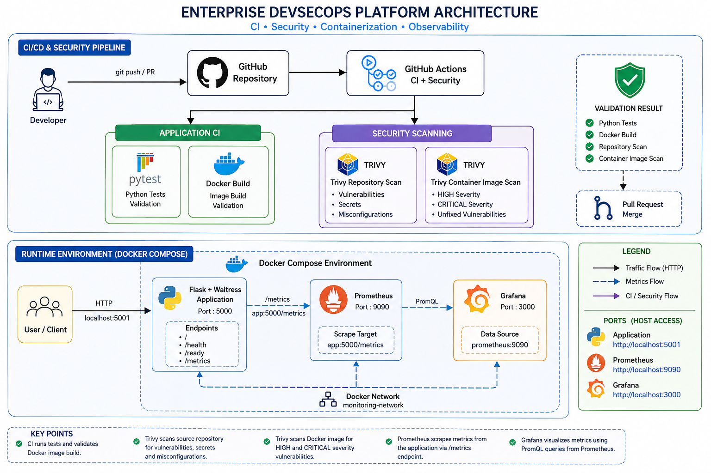
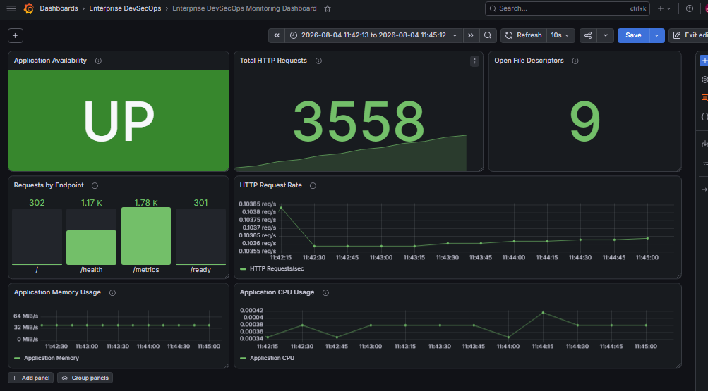
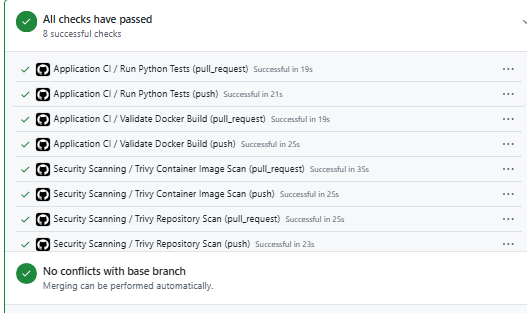

# 🚀 Enterprise DevSecOps Platform

> **A production-inspired DevSecOps engineering platform built to demonstrate the complete path from code to validated, observable, and security-scanned software.**

This repository is not intended to be a collection of disconnected DevOps tools.

It is being developed incrementally as a single engineering platform where application development, containerization, testing, observability, CI, security scanning, troubleshooting, and Git workflows operate together.

```text
Build → Test → Containerize → Observe → Secure → Validate → Improve
```

---

# 🏗️ Current Platform Architecture

The following diagram represents the platform implemented through **Phase 6**.

It combines application CI, Docker validation, Trivy security scanning, containerized runtime services, Prometheus monitoring, and Grafana observability.



### Architecture Summary

```text
Developer
    |
    | git push / pull request
    v
GitHub Repository
    |
    v
GitHub Actions
    |
    +-----------------------------+
    |                             |
    v                             v
Application CI                Security Scanning
    |                             |
    +--> Pytest                   +--> Trivy Repository Scan
    |                             |
    +--> Docker Build             +--> Trivy Container Image Scan
    |                             |
    +-------------+---------------+
                  |
                  v
            Validation Result
                  |
                  v
          Pull Request / Merge
```

Runtime and observability:

```text
User / Client
      |
      | HTTP localhost:5001
      v
Flask + Waitress
Application :5000
      |
      | /metrics
      v
Prometheus :9090
      |
      | PromQL
      v
Grafana :3000
```

Internal Docker communication:

```text
Prometheus → app:5000/metrics
Grafana    → prometheus:9090
```

> **Architecture scope:** This diagram represents the implemented Phase 1–6 platform. It will evolve when Kubernetes and Helm are introduced.

---

# 🟢 Project Status

| Phase   | Engineering Area                            | Status     |
| ------- | ------------------------------------------- | ---------- |
| Phase 1 | Repository Foundation                       | ✅ Complete |
| Phase 2 | Flask Application & Operational Endpoints   | ✅ Complete |
| Phase 3 | Docker Containerization & Runtime Hardening | ✅ Complete |
| Phase 4 | Prometheus & Grafana Observability          | ✅ Complete |
| Phase 5 | Automated Testing & GitHub Actions CI       | ✅ Complete |
| Phase 6 | DevSecOps Security Scanning                 | ✅ Complete |
| Phase 7 | Kubernetes Deployment                       | 🚧 Next    |
| Phase 8 | Helm Packaging                              | ⏳ Planned  |
| Phase 9 | Final Architecture & Engineering Release    | ⏳ Planned  |

---

# ⭐ Engineering Highlights

## 🔄 Continuous Integration

Application changes are automatically validated using:

* Pytest
* API endpoint tests
* Test coverage
* Docker image build validation
* Push-triggered workflows
* Pull-request-triggered workflows

---

## 🔐 Shift-Left Security

Security checks run as part of the development workflow instead of waiting until deployment.

Implemented controls include:

* Repository vulnerability scanning
* Secret scanning
* Misconfiguration scanning
* Container image scanning
* HIGH and CRITICAL vulnerability analysis
* Unfixed-vulnerability filtering
* Runtime dependency verification

---

## 📊 Observability

Prometheus and Grafana provide visibility into:

* Application availability
* HTTP request totals
* Requests by endpoint
* HTTP request rate
* Application memory usage
* Application CPU usage
* Open file descriptors

---

## 🐳 Container Security

The runtime includes:

* Slim Python base image
* Dedicated non-root user
* Waitress WSGI server
* Docker health checks
* Optimized dependency layers
* Dedicated Docker networking
* Persistent monitoring volumes

---

## 🌿 Controlled Git Workflow

Development is performed through feature branches and pull requests:

```text
Feature Branch
      ↓
Implementation
      ↓
Tests + Build + Security
      ↓
Pull Request
      ↓
GitHub Actions
      ↓
Validated Merge
      ↓
main
```

---

# 🧰 Technology Stack

| Area                    | Technologies                   |
| ----------------------- | ------------------------------ |
| Application             | Python, Flask                  |
| Production WSGI         | Waitress                       |
| Testing                 | Pytest, pytest-cov             |
| Containerization        | Docker                         |
| Multi-container Runtime | Docker Compose                 |
| Metrics                 | Prometheus                     |
| Visualization           | Grafana                        |
| CI                      | GitHub Actions                 |
| Security                | Trivy                          |
| Version Control         | Git, GitHub                    |
| Local Development       | Visual Studio Code, PowerShell |
| Next Platform Layer     | Kubernetes                     |
| Future Packaging        | Helm                           |

---

# 📁 Repository Structure

```text
enterprise-devsecops-platform/
│
├── .github/
│   └── workflows/
│       ├── ci.yml
│       └── security.yml
│
├── app/
│   └── app.py
│
├── diagrams/
│   └── enterprise-devsecops-platform-architecture.png
│
├── docs/
│   ├── 04-monitoring-stack.md
│   └── 06-security-scanning.md
│
├── helm/
│
├── kubernetes/
│
├── monitoring/
│   ├── grafana/
│   │   └── dashboards/
│   └── prometheus/
│       └── prometheus.yml
│
├── screenshots/
│
├── security/
│   └── reports/
│
├── tests/
│   └── test_app.py
│
├── .dockerignore
├── .gitattributes
├── .gitignore
├── compose.yaml
├── Dockerfile
├── requirements.txt
├── requirements-dev.txt
└── README.md
```

---

# 🌐 Application Layer

The application exposes operational endpoints designed for application access, monitoring, and future orchestration.

| Endpoint      | Purpose                               |
| ------------- | ------------------------------------- |
| `/`           | Application information               |
| `/health`     | Confirms application health           |
| `/ready`      | Confirms readiness to receive traffic |
| `/metrics`    | Exposes Prometheus metrics            |
| Invalid route | Returns structured JSON 404 response  |

The application runs behind **Waitress** rather than the Flask development server.

---

# 🐳 Phase 3 — Containerization & Runtime Hardening

The Flask application is packaged into a Docker image.

Implemented practices include:

* Python slim base image
* Non-root application user
* Waitress production server
* Docker health check
* `.dockerignore`
* OCI image metadata
* Optimized dependency installation
* Runtime verification

Build:

```powershell
docker build -t enterprise-devsecops-platform:1.0.1 .
```

Run:

```powershell
docker run -d `
  --name enterprise-devsecops `
  --restart unless-stopped `
  -p 5001:5000 `
  enterprise-devsecops-platform:1.0.1
```

Verify:

```powershell
docker ps
docker logs enterprise-devsecops
docker exec enterprise-devsecops whoami
```

Expected runtime identity:

```text
appuser
```

Running the application as a non-root user reduces unnecessary container privileges.

---

# 🔗 Docker Compose Runtime

The runtime stack contains:

```text
Flask Application
       +
Prometheus
       +
Grafana
```

Start:

```powershell
docker compose up -d --build
```

Validate:

```powershell
docker compose ps
```

Stop:

```powershell
docker compose down
```

> Avoid `docker compose down -v` unless monitoring volumes are intentionally being deleted.

---

# 🌐 Docker Networking

Host access:

```text
Application → http://localhost:5001
Prometheus  → http://localhost:9090
Grafana     → http://localhost:3000
```

Internal Docker communication:

```text
Prometheus → http://app:5000/metrics
Grafana    → http://prometheus:9090
```

The services communicate through the dedicated Docker Compose monitoring network.

Docker service names are used as internal DNS names instead of depending on changing container IP addresses.

---

# 📊 Phase 4 — Monitoring & Observability

Phase 4 introduced application observability using:

```text
Application
     ↓
Prometheus
     ↓
Grafana
```

Prometheus scrapes:

```text
app:5000/metrics
```

Grafana uses:

```text
prometheus:9090
```

as its Prometheus data source.

---

## 📈 Grafana Dashboard

Dashboard:

```text
Enterprise DevSecOps Monitoring Dashboard
```

Implemented panels:

| Panel                    | Visualization | Purpose                |
| ------------------------ | ------------- | ---------------------- |
| Application Availability | Stat          | Application UP/DOWN    |
| Total HTTP Requests      | Stat          | Cumulative traffic     |
| Requests by Endpoint     | Bar Gauge     | Endpoint traffic       |
| HTTP Request Rate        | Time Series   | Requests per second    |
| Application Memory Usage | Time Series   | Runtime memory         |
| Application CPU Usage    | Time Series   | CPU utilization        |
| Open File Descriptors    | Stat          | Runtime resource usage |

### Final Dashboard



---

# 🔎 Prometheus Queries

### Application Availability

```promql
up{job="enterprise-devsecops-app"}
```

### Total HTTP Requests

```promql
sum(application_http_requests_total)
```

### Requests by Endpoint

```promql
sum by (endpoint) (
  application_http_requests_total
)
```

### HTTP Request Rate

```promql
sum(
  rate(application_http_requests_total[5m])
)
```

### Application CPU Usage

```promql
sum(
  rate(process_cpu_seconds_total{job="enterprise-devsecops-app"}[5m])
)
```

---

# 🧪 Phase 5 — Automated Testing & CI

Phase 5 introduced automated quality validation.

The project uses:

* `pytest`
* `pytest-cov`
* GitHub Actions

Tests validate:

* Home endpoint
* Health endpoint
* Readiness endpoint
* Metrics endpoint
* Invalid-route behavior

Current local test result:

```text
5 tests passed
```

The CI workflow performs:

```text
Push / Pull Request
        ↓
Checkout Repository
        ↓
Setup Python
        ↓
Install Dependencies
        ↓
Run Pytest
        ↓
Validate Docker Build
        ↓
CI Result
```

This ensures application changes are validated before integration.

---

# 🔐 Phase 6 — DevSecOps Security Scanning

Phase 6 introduced automated security checks using:

```text
Trivy + GitHub Actions
```

The security workflow performs two primary jobs.

---

## 🔍 Repository Security Scan

The repository is analyzed for:

* Vulnerabilities
* Secrets
* Misconfigurations

Conceptually:

```text
Source Repository
      |
      +--> Vulnerabilities
      |
      +--> Secrets
      |
      +--> Misconfigurations
```

Workflow:

```text
.github/workflows/security.yml
```

---

## 🛡️ Container Image Security Scan

The application image is also scanned after building:

```text
Source Code
     ↓
Docker Build
     ↓
Container Image
     ↓
Trivy Image Scan
     ↓
HIGH / CRITICAL Findings
```

This detects risks originating from both:

* application packages;
* operating-system packages inside the image.

---

# 🧠 Vulnerability Investigation

A scanner result was treated as an investigation trigger rather than automatically changing dependencies.

The approach used was:

```text
Detect
   ↓
Verify
   ↓
Analyze Runtime Impact
   ↓
Check Available Remediation
   ↓
Remediate or Document
   ↓
Re-scan
```

Python findings involving packages such as `msgpack` and `setuptools` were verified directly inside the runtime container.

Runtime verification included:

```powershell
docker run --rm `
  --entrypoint python `
  enterprise-devsecops-platform:security `
  -m pip list
```

This helped distinguish actual runtime dependencies from metadata/SBOM-related findings.

---

# 🧯 Security Pipeline Troubleshooting

The GitHub Actions security workflow did not pass on the first attempt.

Application CI continued to succeed:

```text
Python Tests       → PASS
Docker Build       → PASS
```

but both Trivy jobs initially failed during:

```text
Install Trivy
```

The problem was isolated to the security-tool setup rather than application code.

The pinned Trivy GitHub Action integration was updated and the workflow was executed again.

Final result:

```text
Application Tests              PASS
Docker Build Validation        PASS
Trivy Repository Scan          PASS
Trivy Container Image Scan     PASS
```

---

# ✅ GitHub Actions Validation

Phase 6 concluded with:

> **8 successful GitHub Actions checks**

across application CI and security validation.



Validated checks include:

* Python tests
* Docker build validation
* Repository security scanning
* Container image scanning
* Push workflow validation
* Pull-request workflow validation

---

# 🛡️ CI + Security Pipeline

```text
                  Git Push / Pull Request
                            |
               +------------+------------+
               |                         |
               v                         v
         Application CI             Security CI
               |                         |
        +------+-------+          +------+------+
        |              |          |             |
        v              v          v             v
      Pytest       Docker Build  Repo Scan    Image Scan
        |              |          |             |
        +------+-------+          +------+------+
               |                         |
               +------------+------------+
                            |
                            v
                     Validation Result
                            |
                            v
                       PR / Merge
```

---

# ⚙️ Security Baseline Strategy

The initial workflow uses:

```yaml
exit-code: 0
```

This establishes **security visibility** before enforcing blocking rules.

Current approach:

```text
Finding
   ↓
Report
   ↓
Investigate
   ↓
Document / Remediate
```

Future enforcement can selectively use:

```yaml
exit-code: 1
```

for vulnerabilities that should block unsafe changes.

This introduces security progressively:

```text
Visibility → Understanding → Enforcement
```

---

# 🧯 Engineering Troubleshooting Cases

This repository intentionally documents failures as well as successful implementations.

---

## Case 1 — Host Port Conflict

Error:

```text
Bind for 0.0.0.0:5000 failed: port is already allocated
```

Root cause:

A Windows Python process was already using host port `5000`.

Resolution:

```text
Host Access:
localhost:5001

Container:
app:5000
```

The experience demonstrated the difference between host port mapping and container networking.

---

## Case 2 — Docker Outbound Networking

During an image build, Windows could reach PyPI while Docker bridge-network containers could not.

Host test:

```text
Windows → PyPI → reachable
```

Container test:

```text
Docker bridge → PyPI → network unreachable
```

Docker DNS resolution worked, but outbound bridge connectivity failed.

Host-network validation returned:

```text
HTTP 200
```

The image was successfully built using:

```powershell
docker build --network=host -t enterprise-devsecops-platform:ci .
```

---

## Case 3 — Missing Runtime Dependency

A container initially failed with:

```text
exec: "waitress-serve": executable file not found in $PATH
```

Runtime and development dependencies were separated and the rebuilt image was validated successfully.

---

## Case 4 — Trivy GitHub Action Setup

Application CI passed while security jobs failed during Trivy installation.

The issue was isolated, the action integration was updated, and the complete pipeline was rerun successfully.

Final result:

```text
8 / 8 checks passed
```

---

# 🔒 Current Security & Reliability Practices

The platform currently demonstrates:

* Non-root container runtime
* Minimal Python image
* Application health checks
* Application readiness checks
* Prometheus metrics
* Dedicated Docker network
* Persistent monitoring storage
* Read-only Prometheus configuration
* Automated unit/API testing
* Docker build validation
* Repository vulnerability scanning
* Secret scanning
* Misconfiguration scanning
* Container vulnerability scanning
* Runtime dependency verification
* Feature-branch development
* Pull-request validation
* GitHub Actions automation

---

# 📚 Engineering Skills Demonstrated

The project currently provides hands-on experience with:

### Application Engineering

* Python
* Flask
* Waitress
* Operational endpoints

### Containers

* Docker
* Image layers
* Build caching
* Runtime security
* Docker Compose
* Container networking

### Observability

* Prometheus
* PromQL
* Grafana
* Application metrics
* Runtime metrics

### Continuous Integration

* GitHub Actions
* Pytest
* Coverage
* Docker validation

### DevSecOps

* Trivy
* Repository scanning
* Secret scanning
* Misconfiguration scanning
* Container CVE scanning
* Vulnerability triage

### Source Control

* Git
* Feature branches
* Pull requests
* Controlled merging
* Documentation-driven development

### Troubleshooting

* Port conflicts
* Docker networking
* Runtime dependencies
* CI failures
* Security-action failures
* Scanner findings

---

# 🗺️ Project Roadmap

## ✅ Phase 1 — Repository Foundation

* [x] Repository structure
* [x] Git initialization
* [x] GitHub repository
* [x] Feature-branch workflow

## ✅ Phase 2 — Application

* [x] Flask application
* [x] Health endpoint
* [x] Readiness endpoint
* [x] Metrics endpoint
* [x] Structured 404 response

## ✅ Phase 3 — Containerization

* [x] Dockerfile
* [x] Waitress server
* [x] Non-root runtime
* [x] Docker health checks
* [x] Image optimization

## ✅ Phase 4 — Monitoring & Observability

* [x] Docker Compose stack
* [x] Prometheus
* [x] Grafana
* [x] Application availability
* [x] HTTP request totals
* [x] Requests by endpoint
* [x] HTTP request rate
* [x] Memory usage
* [x] CPU usage
* [x] Open file descriptors
* [x] Final dashboard layout
* [x] Grafana dashboard JSON export

## ✅ Phase 5 — Testing & CI

* [x] Pytest
* [x] API endpoint tests
* [x] Coverage
* [x] Docker build validation
* [x] GitHub Actions CI
* [x] Push validation
* [x] Pull-request validation

## ✅ Phase 6 — DevSecOps Security

* [x] Trivy repository scan
* [x] Vulnerability scanning
* [x] Secret scanning
* [x] Misconfiguration scanning
* [x] Container image scanning
* [x] HIGH/CRITICAL analysis
* [x] Runtime dependency verification
* [x] Security GitHub Actions workflow
* [x] Security troubleshooting
* [x] Pull-request validation

## 🚧 Phase 7 — Kubernetes

* [ ] Namespace
* [ ] Deployment
* [ ] Service
* [ ] ConfigMap
* [ ] Liveness probe
* [ ] Readiness probe
* [ ] Resource requests
* [ ] Resource limits
* [ ] Horizontal scaling
* [ ] Monitoring integration

## ⏳ Phase 8 — Helm

* [ ] Helm chart
* [ ] Templates
* [ ] Values files
* [ ] Environment-specific configuration
* [ ] Reusable deployments

## ⏳ Phase 9 — Final Engineering Release

* [ ] Final architecture diagram
* [ ] Kubernetes architecture
* [ ] Security architecture
* [ ] End-to-end workflow documentation
* [ ] Final screenshots
* [ ] Release notes
* [ ] Portfolio presentation

---

# 📖 Detailed Documentation

| Phase   | Documentation                                               |
| ------- | ----------------------------------------------------------- |
| Phase 4 | [Monitoring & Observability](docs/04-monitoring-stack.md)   |
| Phase 6 | [DevSecOps Security Scanning](docs/06-security-scanning.md) |

The README describes the platform at a high level.

The phase documents contain deeper:

* implementation details;
* commands;
* troubleshooting;
* decisions;
* screenshots;
* lessons learned.

---

# 🌿 Git Development Model

Development is performed using dedicated feature branches.

Examples:

```text
main
 |
 +---- feature/monitoring-stack
 |
 +---- feature/testing-ci
 |
 +---- feature/security-scanning
 |
 +---- feature/architecture-readme
```

Standard flow:

```text
Create Branch
      ↓
Implement
      ↓
Validate Locally
      ↓
Commit
      ↓
Push
      ↓
Pull Request
      ↓
GitHub Actions
      ↓
Review
      ↓
Merge
```

---

# 💡 Engineering Philosophy

This project follows five working principles.

### 1. Build It

Implement the capability.

### 2. Understand It

Understand how the components communicate.

### 3. Break It

Observe realistic failure scenarios.

### 4. Troubleshoot It

Identify the root cause rather than copying a workaround.

### 5. Document It

Record architecture, commands, decisions, screenshots, failures, and lessons.

```text
Build → Validate → Observe → Secure → Troubleshoot → Improve
```

---

# 🔭 What's Next?

## ☸️ Phase 7 — Kubernetes Deployment

The next phase will move the containerized application toward Kubernetes while preserving the capabilities already built.

```text
Application
     +
Docker
     +
Health / Readiness
     +
Metrics
     +
Testing
     +
CI
     +
Security Scanning
     ↓
Kubernetes
```

The objective will not simply be to create Kubernetes YAML files.

The phase will focus on understanding:

* pod lifecycle;
* service exposure;
* configuration management;
* health probes;
* resource management;
* scaling;
* observability;
* security validation.

---

# 👨‍💻 Author

**Yogesh Heddure**

GitHub: [YogeshS-Mca](https://github.com/YogeshS-Mca)

Repository: [Enterprise DevSecOps Platform](https://github.com/YogeshS-Mca/Enterprise-DevSecOps-Platform)

---

# 📌 Project Purpose

This repository is maintained as a hands-on **DevOps / DevSecOps engineering portfolio project**.

The goal is to demonstrate not only successful configurations, but also:

* architecture decisions;
* implementation reasoning;
* testing;
* monitoring;
* security validation;
* troubleshooting;
* Git workflows;
* lessons learned.

The platform will continue evolving through Kubernetes, Helm, and final release architecture.
