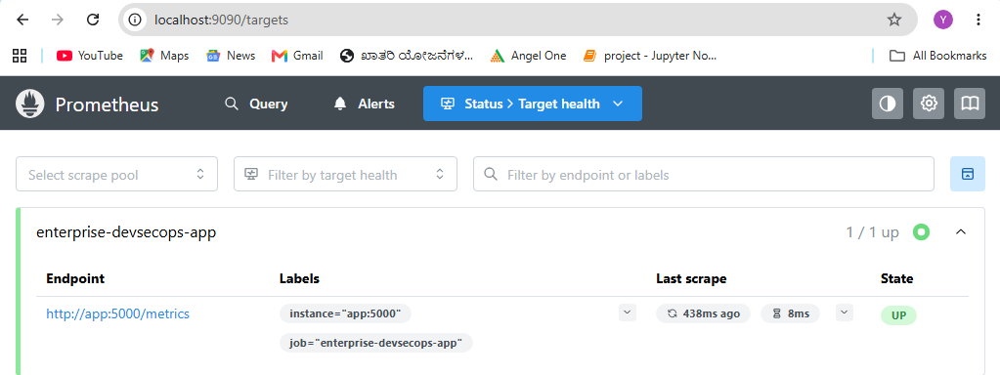
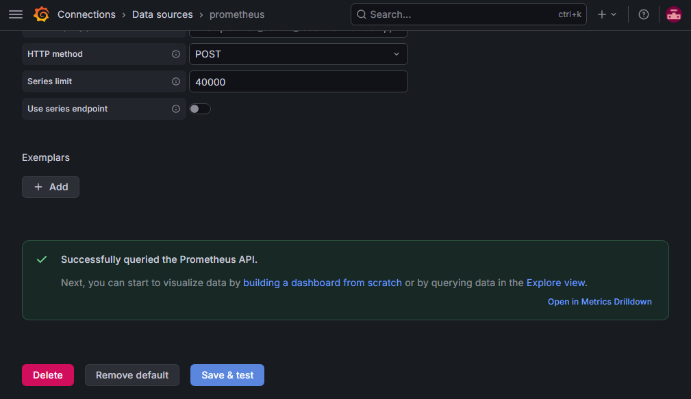

# Enterprise DevSecOps Platform

A production-style DevSecOps portfolio project that demonstrates application development, containerization, monitoring, observability, Docker networking, and structured GitHub workflows.

The platform currently includes a Python Flask application served by Waitress, containerized with Docker, orchestrated with Docker Compose, monitored by Prometheus, and visualized in Grafana.

---

## Project Status

- ✅ Phase 1 — Repository initialization
- ✅ Phase 2 — Flask application and operational endpoints
- ✅ Phase 3 — Docker containerization and security hardening
- 🔄 Phase 4 — Docker Compose monitoring stack
- ⏳ Phase 5 — Automated testing and GitHub Actions CI
- ⏳ Phase 6 — Security scanning
- ⏳ Phase 7 — Kubernetes deployment
- ⏳ Phase 8 — Helm packaging
- ⏳ Phase 9 — Final architecture and release documentation

---

## Solution Overview

The project is designed as a practical learning platform for DevOps and DevSecOps concepts.

```text
User / PowerShell
        |
        v
Windows Host Port 5001
        |
        v
Flask Application Containera
        |
        +--> /health
        +--> /ready
        +--> /metrics
        |
        v
Prometheus
        |
        v
Grafana Dashboard
```

Internal Docker communication:

```text
Grafana --> http://prometheus:9090
Prometheus --> http://app:5000/metrics
```

Host access:

```text
Application --> http://localhost:5001
Prometheus  --> http://localhost:9090
Grafana     --> http://localhost:3000
```

---

## Current Features

### Application

- Python Flask application
- Waitress WSGI server
- JSON-based application response
- Health endpoint: `/health`
- Readiness endpoint: `/ready`
- Prometheus metrics endpoint: `/metrics`
- Custom HTTP request counter
- Custom 404 response

### Docker

- Slim Python base image
- Non-root application user
- Docker health check
- OCI image metadata
- Optimized dependency installation
- `.dockerignore`
- Versioned images
- Restart policy

### Docker Compose

- Flask application service
- Prometheus service
- Grafana service
- Dedicated bridge network
- Persistent named volumes
- Service dependency based on application health
- Host-to-container port mapping

### Monitoring and Observability

- Prometheus scraping through Docker service discovery
- Grafana connected to Prometheus
- Application availability panel
- Total HTTP request panel
- Requests grouped by endpoint
- HTTP request rate panel
- Prometheus target validation
- Container-to-container connectivity testing

---

## Technologies

| Category | Tools |
|---|---|
| Application | Python, Flask, Waitress |
| Containerization | Docker, Docker Compose |
| Monitoring | Prometheus, Grafana |
| Version Control | Git, GitHub |
| Development | Visual Studio Code, PowerShell |
| Planned | GitHub Actions, Trivy, Checkov, Kubernetes, Helm |

---

## Repository Structure

```text
enterprise-devsecops-platform/
|
|-- app/
|   `-- app.py
|
|-- diagrams/
|
|-- docker/
|
|-- docs/
|   `-- 04-monitoring-stack.md
|
|-- helm/
|
|-- jenkins/
|
|-- kubernetes/
|
|-- monitoring/
|   |-- grafana/
|   `-- prometheus/
|       `-- prometheus.yml
|
|-- screenshots/
|
|-- scripts/
|
|-- security/
|
|-- tests/
|
|-- .dockerignore
|-- .gitattributes
|-- .gitignore
|-- compose.yaml
|-- Dockerfile
|-- README.md
`-- requirements.txt
```

---

## Application Endpoints

| Endpoint | Purpose |
|---|---|
| `/` | Returns application details |
| `/health` | Confirms that the application process is healthy |
| `/ready` | Confirms that the application is ready to receive traffic |
| `/metrics` | Exposes Prometheus metrics |
| Invalid route | Returns a structured 404 JSON response |

---

## Docker Image

Build the image:

```powershell
docker build -t enterprise-devsecops-platform:1.0.1 .
```

Run the image manually:

```powershell
docker run -d `
  --name enterprise-devsecops `
  --restart unless-stopped `
  -p 5001:5000 `
  enterprise-devsecops-platform:1.0.1
```

Verify:

```powershell
docker ps
docker logs enterprise-devsecops
docker exec enterprise-devsecops whoami
```

Expected runtime user:

```text
appuser
```

---

## Start the Monitoring Stack

Validate the Compose configuration:

```powershell
docker compose config
```

Start all services:

```powershell
docker compose up -d --build
```

Check service status:

```powershell
docker compose ps
```

Stop the stack:

```powershell
docker compose down
```

Do not use `docker compose down -v` unless you intentionally want to delete Prometheus and Grafana data.

---

## Docker Networking

The services are connected through a custom bridge network.

```text
enterprise-devsecops-platform_monitoring-network
```

Prometheus accesses the application using:

```text
http://app:5000/metrics
```

Grafana accesses Prometheus using:

```text
http://prometheus:9090
```

Docker Compose service names act as internal DNS names. Container IP addresses may change, but service names remain stable.

Inspect the network:

```powershell
docker network inspect enterprise-devsecops-platform_monitoring-network
```

Test container-to-container communication:

```powershell
docker compose exec prometheus sh
```

Inside the Prometheus container:

```sh
wget -qO- http://app:5000/health
```

---

## Prometheus Configuration

Prometheus configuration file:

```text
monitoring/prometheus/prometheus.yml
```

Current scrape target:

```yaml
targets:
  - "app:5000"
```

Metrics path:

```text
/metrics
```

Useful PromQL queries:

### Application availability

```promql
up{job="enterprise-devsecops-app"}
```

### Total HTTP requests

```promql
sum(application_http_requests_total)
```

### Requests by endpoint

```promql
sum by (endpoint) (
  application_http_requests_total
)
```

### HTTP request rate

```promql
sum(
  rate(application_http_requests_total[5m])
)
```

---

## Grafana Dashboard

Dashboard name:

```text
Enterprise DevSecOps Monitoring Dashboard
```

Current panels:

| Panel | Visualization | Purpose |
|---|---|---|
| Application Availability | Stat | Shows `UP` or `DOWN` |
| Total HTTP Requests | Stat | Shows cumulative request count |
| Requests by Endpoint | Bar gauge | Compares traffic by endpoint |
| HTTP Request Rate | Time series | Shows current requests per second |

Planned panels:

- Application memory usage
- Application CPU usage
- Open file descriptors
- Final monitoring summary

---

## Monitoring Screenshots

### Application availability


### Total HTTP requests


### Requests by endpoint


### HTTP request rate configuration


### Dashboard progress


### Prometheus target



### Grafana data source



---

## Traffic Generation

The following PowerShell loop generates test traffic:

```powershell
1..100 | ForEach-Object {
    Invoke-RestMethod http://localhost:5001/ | Out-Null
    Invoke-RestMethod http://localhost:5001/health | Out-Null
    Invoke-RestMethod http://localhost:5001/ready | Out-Null
    Start-Sleep -Milliseconds 100
}
```

This sends:

```text
100 requests to /
100 requests to /health
100 requests to /ready
300 total requests
```

Prometheus must scrape the application before Grafana displays the updated data.

---

## Troubleshooting Case — Port Conflict

### Error

```text
Bind for 0.0.0.0:5000 failed: port is already allocated
```

### Investigation

The process using port `5000` was identified with:

```powershell
Get-NetTCPConnection -LocalPort 5000 -ErrorAction SilentlyContinue |
Select-Object LocalAddress, LocalPort, State, OwningProcess
```

The owning process was checked using:

```powershell
Get-Process -Id <PID>
```

### Root Cause

A local Python process was already using Windows host port `5000`.

### Resolution

The conflicting Python process was stopped:

```powershell
Stop-Process -Id <PID>
```

The incomplete Compose stack was removed:

```powershell
docker compose down
```

The host mapping was changed from:

```yaml
ports:
  - "5000:5000"
```

to:

```yaml
ports:
  - "5001:5000"
```

Prometheus continued to use the internal Docker address:

```text
app:5000
```

The stack was rebuilt:

```powershell
docker compose up -d --build
```

### Learning

```text
Windows access: localhost:5001
Docker internal access: app:5000
```

Changing the host port did not change container-to-container communication.

---

## Security and Reliability

- Application runs as a non-root user
- Docker health check is configured
- Prometheus configuration is mounted read-only
- Named volumes persist monitoring data
- Services use a dedicated bridge network
- Restart policies use `unless-stopped`
- Local virtual environment is excluded from the image
- Unnecessary files are excluded through `.dockerignore`

---

## Learning Outcomes

This project currently demonstrates:

- Flask application development
- WSGI application serving
- Docker image creation
- Docker layer caching
- Non-root container execution
- Docker health checks
- Docker Compose orchestration
- Service discovery
- Host and container port mapping
- Custom bridge networking
- Prometheus scraping
- PromQL
- Grafana visualization
- Traffic generation
- Monitoring troubleshooting
- Git feature-branch workflow
- Pull-request-based development

---

## Roadmap

### Phase 4 — Complete Monitoring

- [x] Application availability
- [x] Total HTTP requests
- [x] Requests by endpoint
- [x] HTTP request rate
- [ ] Memory usage
- [ ] CPU usage
- [ ] Open file descriptors
- [ ] Final dashboard layout
- [ ] Dashboard JSON export

### Phase 5 — Testing and CI

- [ ] Unit tests
- [ ] API endpoint tests
- [ ] Docker build validation
- [ ] GitHub Actions workflow
- [ ] Automated linting

### Phase 6 — DevSecOps

- [ ] Trivy image scanning
- [ ] Checkov configuration scanning
- [ ] Dependency scanning
- [ ] SonarQube analysis
- [ ] Security reporting

### Phase 7 — Kubernetes

- [ ] Deployment
- [ ] Service
- [ ] ConfigMap
- [ ] Probes
- [ ] Resource limits
- [ ] Horizontal scaling

### Phase 8 — Helm

- [ ] Helm chart
- [ ] Values files
- [ ] Reusable templates
- [ ] Environment-specific configuration

---

## Detailed Documentation

- [Phase 4 — Docker Compose Monitoring Stack](docs/04-monitoring-stack.md)

Additional phase documents will be added as the project progresses.

---

## Git Workflow

Feature development is completed through dedicated branches.

Example:

```powershell
git switch -c feature/monitoring-stack
```

After implementation:

```powershell
git add .
git commit -m "feat: add Prometheus and Grafana monitoring stack"
git push -u origin feature/monitoring-stack
```

Changes are reviewed and merged into `main` through a GitHub pull request.

---

## Author

**Yogesh Heddure**

GitHub: [YogeshS-Mca](https://github.com/YogeshS-Mca)

Repository: [Enterprise DevSecOps Platform](https://github.com/YogeshS-Mca/Enterprise-DevSecOps-Platform)

---

## License

This project is currently maintained as a personal learning and portfolio project.
