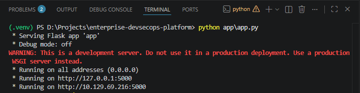
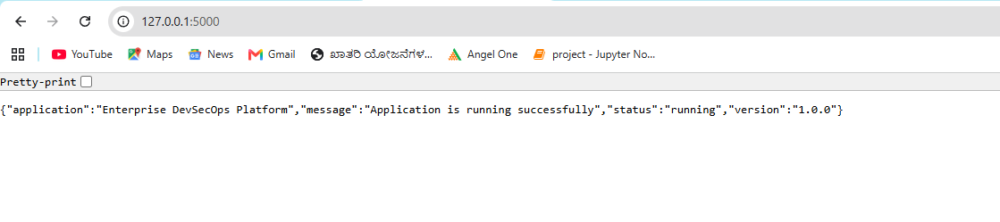
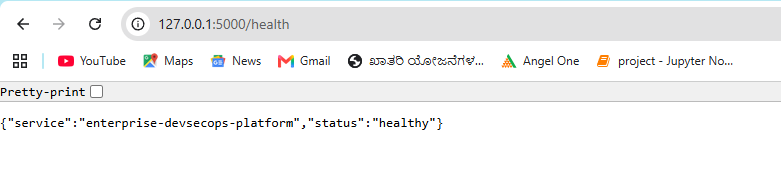
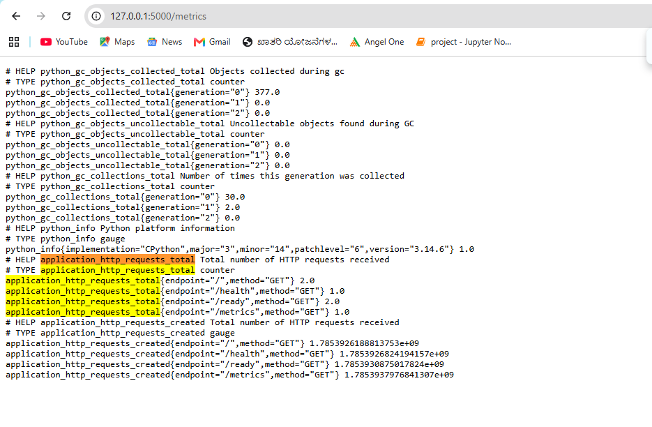

# Phase 2 — Flask Application Development

## Objective

Build a lightweight Python Flask application that can later be tested, containerized, deployed and monitored through a DevSecOps pipeline.

## Technologies Used

- Python
- Flask
- Prometheus Python Client
- PowerShell
- Git
- GitHub

## Application Endpoints

| Endpoint | Purpose | HTTP Status |
|---|---|---:|
| `/` | Returns application information | 200 |
| `/health` | Confirms that the application process is alive | 200 |
| `/ready` | Confirms that the application is ready for traffic | 200 |
| `/metrics` | Exposes Prometheus-compatible metrics | 200 |
| Invalid endpoint | Returns a structured JSON error | 404 |

## Virtual Environment

A Python virtual environment was created to isolate the project dependencies:

```powershell
python -m venv .venv
```

The environment was activated using:

```powershell
.\.venv\Scripts\Activate.ps1
```

Because PowerShell script execution was restricted, the following temporary process-level policy was used:

```powershell
Set-ExecutionPolicy -Scope Process -ExecutionPolicy Bypass
```

This change applied only to the current PowerShell session.

## Dependency Management

The project dependencies are stored in `requirements.txt`.

```text
Flask==3.1.3
prometheus-client==0.26.0
```

Dependencies can be installed using:

```powershell
python -m pip install -r requirements.txt
```

## Running the Application

```powershell
python app\app.py
```

The application listens on:

```text
http://127.0.0.1:5000
```

## Health Endpoint

The `/health` endpoint confirms that the Flask process is running.

This endpoint can later be used as a Kubernetes liveness probe.

## Readiness Endpoint

The `/ready` endpoint confirms that the service is ready to receive requests.

This endpoint can later be used as a Kubernetes readiness probe.

## Prometheus Metrics

The `/metrics` endpoint exposes application metrics in Prometheus format.

The custom request counter is:

```text
application_http_requests_total
```

It tracks requests using the following labels:

- HTTP method
- Application endpoint

Example:

```text
application_http_requests_total{endpoint="/health",method="GET"} 2.0
```

## Custom Error Handling

Invalid application paths return a structured JSON response with HTTP status code `404`.

Example:

```json
{
  "error": "Not Found",
  "message": "The requested endpoint does not exist"
}
```

## Validation Screenshots

### Flask application running



### Home endpoint



### Health endpoint



### Prometheus metrics



## Security Considerations

- Flask debug mode is disabled.
- No credentials or secrets are stored in the application.
- The virtual environment is excluded from Git.
- Invalid endpoints return controlled JSON responses.
- Dependencies are documented in `requirements.txt`.

## Learning Outcome

This phase demonstrates how to:

- Create a Python virtual environment
- Manage dependencies
- Build Flask REST-style endpoints
- Implement liveness and readiness checks
- Expose Prometheus metrics
- Handle invalid URLs
- Validate the application through browser and PowerShell testing