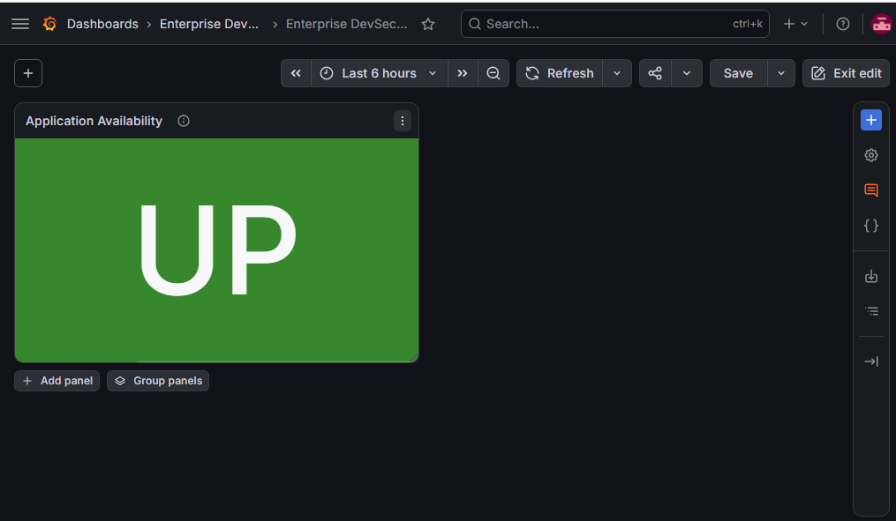
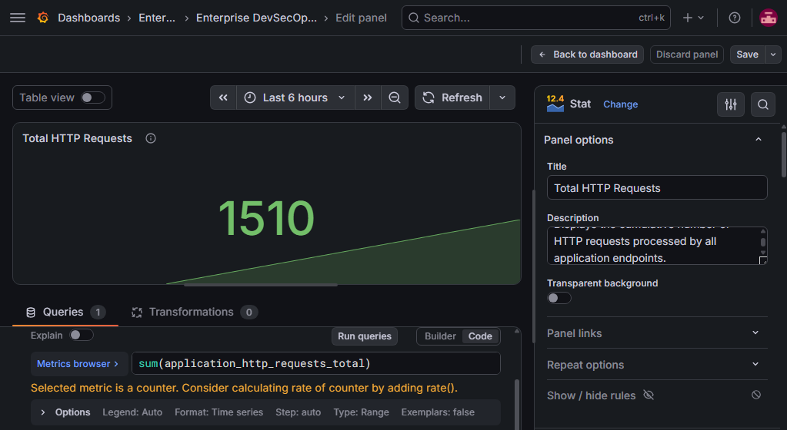
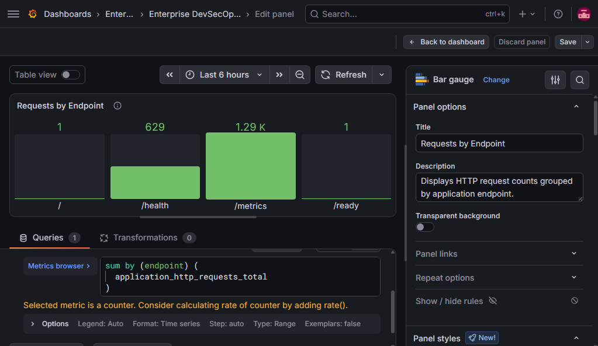
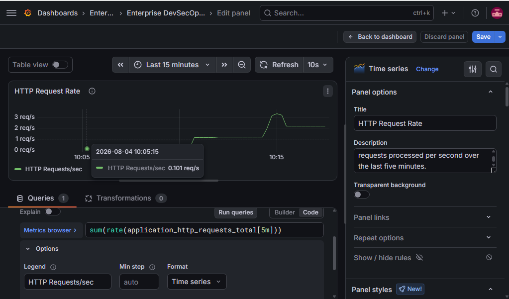
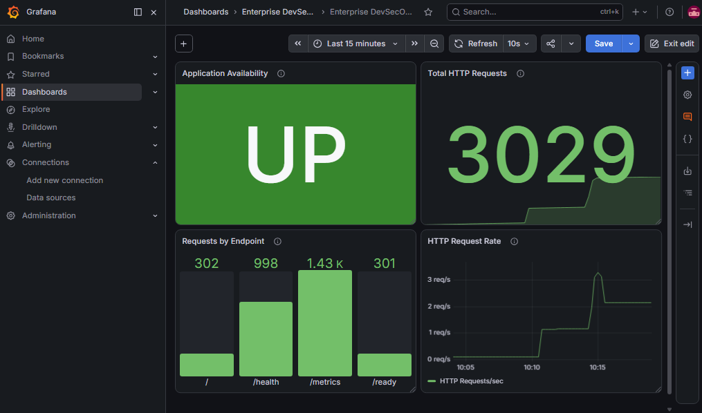
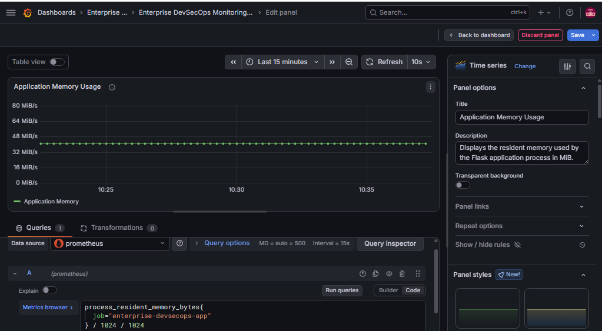
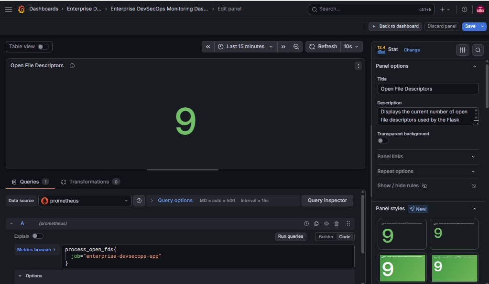

# Phase 4 — Docker Compose Monitoring Stack

## Objective

Build a production-style monitoring and observability stack for the Enterprise DevSecOps Platform using Docker Compose, Prometheus, and Grafana.

This phase demonstrates:

- Multi-container orchestration
- Docker service discovery
- Custom bridge networking
- Prometheus metrics scraping
- Grafana visualization
- Health checks
- Persistent monitoring data
- Host and container port mapping
- Troubleshooting of a real port-conflict issue

---

## Architecture

```text
Windows Browser / PowerShell
        |
        | http://localhost:5001
        v
Flask Application Container
        |
        | exposes /metrics
        v
Prometheus Container
        |
        | queried by Grafana
        v
Grafana Container
```

Internal Docker communication:

```text
Prometheus --> http://app:5000/metrics
Grafana    --> http://prometheus:9090
```

Host access:

```text
Application --> http://localhost:5001
Prometheus  --> http://localhost:9090
Grafana     --> http://localhost:3000
```

---

## Technologies

- Docker
- Docker Compose
- Python
- Flask
- Waitress
- Prometheus
- Grafana
- PowerShell
- Git
- GitHub

---

## Services

| Service | Compose Service Name | Container Name | Host Port | Container Port |
|---|---|---|---:|---:|
| Flask Application | `app` | `enterprise-devsecops-app` | 5001 | 5000 |
| Prometheus | `prometheus` | `enterprise-prometheus` | 9090 | 9090 |
| Grafana | `grafana` | `enterprise-grafana` | 3000 | 3000 |

---

## Docker Compose Configuration

The complete stack is defined in:

```text
compose.yaml
```

The stack includes:

- Flask application service
- Prometheus service
- Grafana service
- Custom Docker bridge network
- Prometheus named volume
- Grafana named volume
- Application health check
- Restart policies
- Read-only Prometheus configuration mount

Validate the configuration:

```powershell
docker compose config
```

Start the stack:

```powershell
docker compose up -d --build
```

Check service status:

```powershell
docker compose ps
```

Stop the stack:

```powershell
docker compose down
```

Do not use the following command unless monitoring data should be deleted:

```powershell
docker compose down -v
```

The `-v` option removes named volumes.

---

## Docker Networking

All three services are connected to a custom bridge network:

```text
enterprise-devsecops-platform_monitoring-network
```

Docker Compose provides internal DNS resolution using service names.

Prometheus accesses the application using:

```text
http://app:5000/metrics
```

Grafana accesses Prometheus using:

```text
http://prometheus:9090
```

Inside a container, `localhost` means that same container.

Therefore:

```text
Prometheus must not use localhost:5000
Grafana must not use localhost:9090
```

Correct internal addresses:

```text
app:5000
prometheus:9090
```

Inspect the network:

```powershell
docker network inspect enterprise-devsecops-platform_monitoring-network
```

Test container-to-container communication:

```powershell
docker compose exec prometheus sh
```

Inside the Prometheus container:

```sh
wget -qO- http://app:5000/health
```

Expected response:

```json
{
  "service": "enterprise-devsecops-platform",
  "status": "healthy"
}
```

Exit the container:

```sh
exit
```

---

## Named Volumes

The stack uses:

```text
prometheus-data
grafana-data
```

Purpose:

```text
prometheus-data:
Persists Prometheus time-series data.

grafana-data:
Persists Grafana users, dashboards, settings, and data-source configuration.
```

A named volume remains available even if its container is deleted.

---

## Prometheus Configuration

Prometheus configuration file:

```text
monitoring/prometheus/prometheus.yml
```

Current configuration:

```yaml
global:
  scrape_interval: 15s
  evaluation_interval: 15s

scrape_configs:
  - job_name: "enterprise-devsecops-app"

    metrics_path: /metrics

    static_configs:
      - targets:
          - "app:5000"
```

### Configuration Explanation

```text
scrape_interval: 15s
Prometheus requests metrics every 15 seconds.

evaluation_interval: 15s
Prometheus evaluates recording and alerting rules every 15 seconds.

job_name:
Identifies the monitored application.

metrics_path:
Defines the endpoint that exposes Prometheus metrics.

target app:5000:
Uses Docker service discovery to reach the Flask container.
```

---

## Application Metrics

The Flask application exposes:

```text
http://localhost:5001/metrics
```

Prometheus accesses the same endpoint internally through:

```text
http://app:5000/metrics
```

Custom request metric:

```text
application_http_requests_total
```

Labels:

```text
method
endpoint
```

Example:

```text
application_http_requests_total{
  endpoint="/health",
  instance="app:5000",
  job="enterprise-devsecops-app",
  method="GET"
}
```

---

## Prometheus Validation

Open:

```text
http://localhost:9090/targets
```

Expected result:

```text
Job: enterprise-devsecops-app
Endpoint: http://app:5000/metrics
State: UP
```

Useful PromQL queries:

### Raw HTTP request counters

```promql
application_http_requests_total
```

### Total HTTP requests

```promql
sum(application_http_requests_total)
```

### Requests grouped by endpoint

```promql
sum by (endpoint) (
  application_http_requests_total
)
```

### Application availability

```promql
up{job="enterprise-devsecops-app"}
```

### Total request rate

```promql
sum(
  rate(application_http_requests_total[5m])
)
```

### Application memory usage

```promql
process_resident_memory_bytes{
  job="enterprise-devsecops-app"
} / 1024 / 1024
```

---

## Grafana Data Source

Grafana URL:

```text
http://localhost:3000
```

Prometheus data-source name:

```text
Enterprise Prometheus
```

Prometheus server URL:

```text
http://prometheus:9090
```

Do not use:

```text
http://localhost:9090
```

Inside the Grafana container, `localhost` refers to Grafana itself.

Successful validation message:

```text
Successfully queried the Prometheus API
```

---

## Grafana Dashboard

Dashboard name:

```text
Enterprise DevSecOps Monitoring Dashboard
```

Current completed panels:

- Application Availability
- Total HTTP Requests
- Requests by Endpoint
- HTTP Request Rate
- Application Memory Usage

Planned panels:

- Application CPU Usage
- Open File Descriptors
- Final dashboard layout

---

## Panel 1 — Application Availability

### Objective

Display whether Prometheus can successfully scrape the Flask application.

### PromQL Query

```promql
up{job="enterprise-devsecops-app"}
```

### Visualization

```text
Stat
```

### Value Mapping

```text
1 --> UP
0 --> DOWN
```

### Thresholds

```text
Base --> Red
1    --> Green
```

Threshold mode:

```text
Absolute
```

### Meaning

```text
1 = Prometheus can reach the application
0 = Prometheus cannot reach the application
```

### Evidence



---

## Panel 2 — Total HTTP Requests

### Objective

Display the cumulative number of HTTP requests processed by all application endpoints.

### PromQL Query

```promql
sum(application_http_requests_total)
```

### Visualization

```text
Stat
```

### Calculation

```text
Last not null
```

### Explanation

The application exports separate counters for:

```text
/
/health
/ready
/metrics
```

The `sum()` function combines all endpoint counters into one total.

The `/metrics` value is normally higher because Prometheus scrapes that endpoint repeatedly.

### Evidence



---

## Panel 3 — Requests by Endpoint

### Objective

Display cumulative HTTP request counts grouped by Flask endpoint.

### PromQL Query

```promql
sum by (endpoint) (
  application_http_requests_total
)
```

### Visualization

```text
Bar gauge
```

### Unit

```text
Misc / short
```

### Thresholds

```text
Base --> Green
Threshold mode --> Absolute
```

### Explanation

`sum by (endpoint)` preserves the endpoint label and combines matching series.

Expected endpoint values:

```text
/
/health
/ready
/metrics
```

### Evidence



---

## Panel 4 — HTTP Request Rate

### Objective

Monitor the current average number of HTTP requests processed per second.

### PromQL Query

```promql
sum(
  rate(application_http_requests_total[5m])
)
```

### Visualization

```text
Time series
```

### Legend

```text
HTTP Requests/sec
```

### Unit

```text
Requests/sec
```

### Time Range

```text
Last 15 minutes
```

### Refresh Interval

```text
10 seconds
```

### Query Explanation

`application_http_requests_total` is a counter.

A counter continuously increases and shows the lifetime total since the application process started.

The `rate()` function calculates the average per-second increase.

```promql
rate(application_http_requests_total[5m])
```

The `[5m]` window uses samples from the previous five minutes.

The outer `sum()` combines rates from all endpoints.

### Data Flow

```text
PowerShell traffic
        |
        v
localhost:5001
        |
        v
Application container port 5000
        |
        v
Flask counters increase
        |
        v
Prometheus scrapes /metrics
        |
        v
Grafana displays requests per second
```

### Traffic Generation

```powershell
1..100 | ForEach-Object {
    Invoke-RestMethod http://localhost:5001/ | Out-Null
    Invoke-RestMethod http://localhost:5001/health | Out-Null
    Invoke-RestMethod http://localhost:5001/ready | Out-Null
    Start-Sleep -Milliseconds 100
}
```

This generates:

```text
100 requests to /
100 requests to /health
100 requests to /ready
300 total requests
```

No terminal output is expected because responses are redirected to `Out-Null`.

### Evidence





---

## Panel 5 — Application Memory Usage

### Objective

Monitor the resident memory consumed by the Flask and Waitress application process.

### PromQL Query

```promql
process_resident_memory_bytes{
  job="enterprise-devsecops-app"
} / 1024 / 1024
```

### Visualization

```text
Time series
```

### Legend

```text
Application Memory
```

### Unit

```text
MiB
```

### Time Range

```text
Last 15 minutes
```

### Refresh Interval

```text
10 seconds
```

### Query Explanation

`process_resident_memory_bytes` returns the physical memory used by the Python application process in bytes.

The query converts bytes into mebibytes:

```text
bytes / 1024 / 1024 = MiB
```

Memory monitoring helps identify:

- Unexpected memory growth
- Memory leaks
- Application instability
- Resource-sizing requirements

### Current Observation

The application uses approximately:

```text
40 MiB
```

The exact value may change while the application is running.

### Evidence

Add the screenshot after saving the panel:

```markdown

```

---

## Troubleshooting Case — Host Port Conflict

### Error

```text
Bind for 0.0.0.0:5000 failed: port is already allocated
```

### Impact

The application container could not start.

Because Prometheus depended on the application becoming healthy, the monitoring stack did not start completely.

### Investigation

Check active listeners:

```powershell
Get-NetTCPConnection -LocalPort 5000 -ErrorAction SilentlyContinue |
Select-Object LocalAddress, LocalPort, State, OwningProcess
```

Identify the process:

```powershell
Get-Process -Id <PID>
```

The investigation identified:

```text
python
com.docker.backend
wslrelay
```

### Root Cause

A locally running Python process was already using host port `5000`.

### Resolution

Stop the local Python process:

```powershell
Stop-Process -Id <PID>
```

Remove the incomplete Compose stack:

```powershell
docker compose down
```

Change the host mapping from:

```yaml
ports:
  - "5000:5000"
```

to:

```yaml
ports:
  - "5001:5000"
```

Restart:

```powershell
docker compose up -d --build
```

### Important Learning

```text
Windows host access:
http://localhost:5001

Docker internal access:
http://app:5000
```

Changing the Windows host port does not change internal Docker communication.

---

## Validation Checklist

- [x] Compose configuration validated
- [x] Application container healthy
- [x] Prometheus container running
- [x] Grafana container running
- [x] Prometheus target UP
- [x] Grafana connected to Prometheus
- [x] Docker internal DNS verified
- [x] Application Availability panel created
- [x] Total HTTP Requests panel created
- [x] Requests by Endpoint panel created
- [x] HTTP Request Rate panel created
- [x] Application Memory Usage panel created
- [ ] Application CPU Usage panel created
- [ ] Open File Descriptors panel created
- [ ] Final dashboard arranged
- [ ] Dashboard JSON exported
- [ ] Final dashboard screenshot captured

---

## Security and Reliability

- Application runs as a non-root user
- Docker health check monitors application availability
- Prometheus configuration is mounted read-only
- Named volumes persist monitoring data
- Services use a dedicated custom bridge network
- Restart policy is configured as `unless-stopped`
- Internal service names are used instead of hard-coded IP addresses

---

## Key Learning Outcomes

This phase demonstrates:

- Multi-container orchestration with Docker Compose
- Docker service discovery
- Bridge networking
- Host and container port mapping
- Prometheus metrics scraping
- PromQL aggregation
- Counter and rate concepts
- Grafana panel creation
- Time-series visualization
- Monitoring-data persistence
- Real-world port-conflict troubleshooting
- Technical documentation
- Screenshot-based validation

---

## Interview Explanation

> I created a multi-container monitoring stack using Docker Compose, Prometheus, and Grafana. The Flask application exposes health, readiness, and Prometheus metrics endpoints. Prometheus scrapes the application through Docker service discovery using `app:5000`, while Grafana connects to Prometheus through `prometheus:9090`. I built panels for application availability, cumulative requests, endpoint traffic, request rate, and memory usage. I also resolved a host-port conflict by identifying the owning process and remapping Windows port 5001 to container port 5000 without changing internal Docker communication.

---

## Next Steps

- Create Open File Descriptors panel
- Arrange all dashboard panels
- Generate final monitoring traffic
- Capture final dashboard screenshot
- Export Grafana dashboard JSON
- Update the main README
- Commit and push the monitoring feature branch
- Create and merge the GitHub pull request

## Panel 6 — Open File Descriptors

### Objective

Monitor the number of open file descriptors currently used by the Flask application process.

### PromQL Query

```promql
process_open_fds{
  job="enterprise-devsecops-app"
}
```

### Visualization

```text
Stat
```

### Unit

```text
Misc / short
```

### Calculation

```text
Last not null
```

### Thresholds

| Value | Meaning | Color |
|--------|---------|-------|
| Base | Normal operating range | Green |
| 100 | High usage warning | Yellow |
| 500 | Critical usage | Red |

Threshold mode:

```text
Absolute
```

### Explanation

A file descriptor is a handle used by Linux to access files, sockets, pipes, and network connections.

Every HTTP request creates or uses file descriptors. Monitoring this metric helps detect resource leaks and application stability issues.

### Typical Values

| Open File Descriptors | Interpretation |
|------------------------|----------------|
| 5–20 | Normal |
| 20–100 | Moderate workload |
| 100+ | Investigate |
| 500+ | Potential resource leak |

### Evidence

```markdown

```
